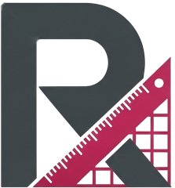

# remx.css

<div align="center">



The simplest CSS framework based on 1rem.

[](https://github.com/BadKarmaDev/remx.css)
[](https://github.com/BadKarmaDev/remx.css)
[](https://postcss.org/)
[](LICENSE)

</div>

## Quick start

```html
<link href="https://unpkg.com/remx.css/dist/remx.min.css" rel="stylesheet" />
```

## What does it do?

*   **Minimalist**: Built on a single unit of measurement (`1rem`).
*   **Lightweight**: ~90KB minified, broken down into 14 independent modules.
*   **Predictable**: Consistent scaling and naming conventions.
*   **Performance**: Zero runtime overhead, just pure CSS.

## Install

```sh
npm install remx.css --save
```

or

```sh
yarn add remx.css
```

## Modular CSS

Import only what you need.

```javascript
import 'remx.css/reset';
import 'remx.css/layout';
import 'remx.css/typography';
```

#### Webpack / Vite Usage

Import [remx.css] in CSS:

```css
@import 'remx.css';
@import 'remx.css/reset';
@import 'remx.css/typography';
```

Alternatively, import [remx.css] in JS:

```js
import 'remx.css';
import 'remx.css/reset';
import 'remx.css/typography';
```

**Download**

See [dist/remx.min.css](dist/remx.min.css)

## Build from source

```sh
npm run build
```

## Browser support

*   Chrome (last 2 versions)
*   Edge (last 2 versions)
*   Firefox (last 2 versions)
*   Safari (last 2 versions)
*   Opera (last 2 versions)

## Documentation

Full documentation is available in the [docs](docs/) directory.
You can also view the [interactive examples](docs/index.html) or the [Class Reference](docs/reference.md).

[remx.css]: https://github.com/badkarmadev/remx

## License

[MIT](LICENSE.txt)
